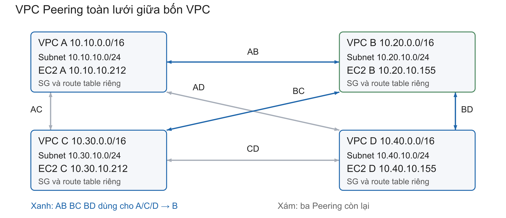
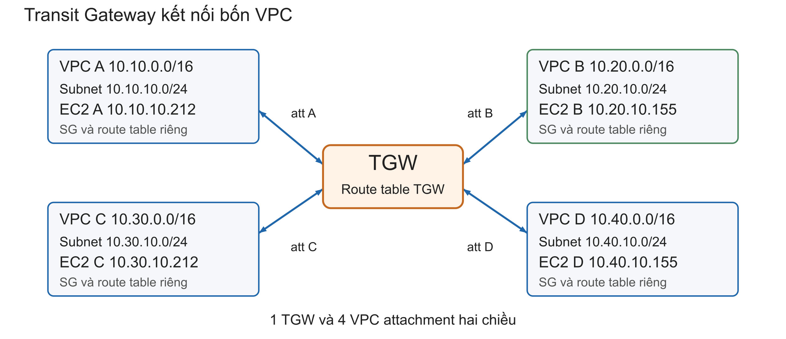

# Đồ án NT531 — Đánh giá hiệu năng AWS VPC Peering và Transit Gateway

## Đồ án trả lời câu hỏi gì?

Giữ nguyên bốn EC2 và điều kiện thử nghiệm, thay đường định tuyến giữa
VPC Peering và Transit Gateway (TGW), rồi so sánh thông lượng, RTT,
retransmission và tải CPU. Kết quả phản ánh toàn đường truyền giữa các
EC2 trong cấu hình này, không phải giới hạn tuyệt đối của dịch vụ AWS.

Tên đăng ký: **Performance Evaluation of AWS VPC Peering and Transit Gateway**.
Bảng lớp ghi nhóm 21, thứ tự báo cáo 9, lịch 26/10.
[Bảng môn học](https://docs.google.com/spreadsheets/d/1WJ8oUXO-NLPxHZ2eL1pFzYHndRo64IWtAPUTtsWq7Ro/edit?gid=0).

## Đọc theo thứ tự

Xem [trạng thái bản công bố ngày 07/10/2026 và việc tiếp theo](docs/19-trang-thai-ban-cong-bo.md).
Bản này gồm Terraform bốn VPC, script đo, sáu bộ kết quả chính đã kiểm chứng,
chương kết quả DOCX, sơ đồ, biểu đồ, công thức và kế hoạch trước 26/10.
Đây chưa phải báo cáo toàn bộ đồ án hoặc bằng chứng đã chạy các bài bổ sung.

Trên GitHub, thiết kế cũ cùng dữ liệu mô phỏng được lưu tại
`legacy/pre-four-vpc/`; không dùng dữ liệu đó để tính kết quả AWS thực nghiệm.
Thư mục này chỉ có trong bản Git công bố; thư mục vận hành giữ state riêng.

1. [Kiến trúc và cách vận hành bốn VPC](docs/03-bon-vpc.md).
2. [Chi tiết Terraform, state và IP SSH](infra/terraform/README.md).
3. [Hướng dẫn đo, nguyên tắc so sánh và câu hỏi bảo vệ](docs/04-do-va-giai-thich.md).
4. [Trạng thái triển khai và kiểm chứng](docs/05-trang-thai-trien-khai.md).
5. [Truy cập và chuẩn bị máy bằng Systems Manager](docs/06-truy-cap-ssm.md).
6. [Kết quả fan-in Peering đã kiểm tra](docs/10-ket-qua-fan-in-peering.md).
7. [Quy trình bài fan-in TGW đã thực hiện](docs/11-do-fan-in-tgw.md).
8. [Kết quả fan-in TGW và đối chiếu Peering](docs/12-ket-qua-fan-in-tgw-va-so-sanh.md).
9. [Chương kết quả DOCX có kiến trúc, biểu đồ và công thức giải thích đầy đủ](docs/13-tong-hop-ket-qua.md).
10. [Công thức, ký hiệu, đơn vị và ví dụ thế số](docs/14-cong-thuc-va-ky-hieu.md).
11. [Khái niệm cho người mới và kết luận Peering TGW có lợi thế ở đâu](docs/15-khai-niem-va-ket-luan-so-sanh.md).
12. [Kế hoạch củng cố đồ án trước ngày 26/10](docs/16-ke-hoach-hoan-thien-den-26-10.md).
13. [Đối chiếu bài giảng NT531, công cụ cần thêm và công thức áp dụng](docs/17-doi-chieu-bai-giang-va-cong-cu.md).
14. [Số liệu từng lượt, công thức và file nguồn để kiểm chứng](docs/18-so-lieu-de-kiem-chung.md).

Kết luận hiện tại: Peering có RTT thấp hơn và TCP một luồng cao hơn
trong các phiên đã đo; TGW có lợi thế kiến trúc về kết nối nhiều VPC
và định tuyến tập trung. Bài fan-in cho thấy giới hạn máy nhận, chưa
xếp hạng năng lực tối đa dịch vụ. Phần bổ sung ưu tiên là đo lặp có
kiểm soát và RTT khi có tải; kế hoạch không có nghĩa đã chạy các bài mới.

`docs/01-hai-vpc.md`, `docs/02-van-hanh-ec2.md` và ảnh tổng quan cũ ghi lại
các bước ban đầu; phạm vi mới nằm ở tài liệu bốn VPC. Không dùng sơ đồ cũ
để xác nhận số tài nguyên đang chạy.

## Kiến trúc

| VPC | CIDR | IP riêng EC2 | Vai trò ví dụ |
|---|---|---|---|
| A | 10.10.0.0/16 | 10.10.10.212 | Nguồn dữ liệu |
| B | 10.20.0.0/16 | 10.20.10.155 | Máy nhận |
| C | 10.30.0.0/16 | 10.30.10.212 | Nguồn dữ liệu |
| D | 10.40.0.0/16 | 10.40.10.155 | Nguồn hoặc máy nhận |

Bốn máy `c6i.large`, cùng AZ `us-east-1a`, cùng AMI, root disk 8 GiB gp3.
Mỗi VPC có một subnet /24, IGW, route table, SG. Mỗi EC2 có một EIP để SSH.

- **Peering:** AB, AC, AD, BC, BD, CD (6 kết nối hai chiều).
- **TGW:** 1 TGW + 4 VPC attachment, mỗi VPC có đường tới ba VPC khác.
- **Chuyển chế độ:** 12 route liên VPC đổi target theo `routing_mode`.
- **Không đổi:** địa chỉ riêng EC2, máy đo, cổng công cụ và đường quản trị.

Hai phương án có thể cùng được cấp tài nguyên nhưng mỗi route chỉ có một
target. `enable_transit_gateway=true` giữ TGW tồn tại; `routing_mode` mới
chọn đường gói tin. Không mặc định dữ liệu tự chia đều qua hai công nghệ.

## Cách hiểu từng thành phần

| Thành phần | Vai trò |
|---|---|
| VPC/subnet | Phân chia mạng và dải địa chỉ |
| Route table | Chọn next hop theo địa chỉ đích |
| Peering | Nối trực tiếp một cặp VPC, không chuyển tiếp qua VPC thứ ba |
| TGW/attachment | Router trung tâm và kết nối của từng VPC vào router |
| SG | Cho phép SSH từ IP quản trị; ICMP và TCP đo giữa các endpoint |
| EIP/IGW | Truy cập quản trị từ máy cá nhân; không phải đường đo private IP |
| Terraform state | Ánh xạ địa chỉ resource trong code với tài nguyên AWS thật |
| iperf3 | Tạo tải và đo thông lượng ở tầng ứng dụng |

SSH dùng `ssh_admin_cidr`; cấu hình demo hiện tại là `0.0.0.0/0` theo yêu cầu.
ICMP giữa các endpoint được cho phép.
TCP 5201–5203 giữa các EC2 dành cho iperf3. Không mở UDP cho bài đo hiện tại.
Ba listener riêng trên mỗi máy hỗ trợ ba client đồng thời tới một receiver.

## Git và nơi chạy lệnh

Thư mục vận hành: `D:\NT531-DanhGiaHieuNang`. State local nằm trong
`infra/terraform/nt531.tfstate`. Các bản Git là bản sao riêng:
đẩy code lên GitHub không đồng nghĩa di chuyển state.

Commit: `.tf`, `.terraform.lock.hcl`, test, scripts, docs, `.example` và
kết quả đã rà soát. Không commit `.pem`, `.tfstate*`, `.tfplan`, file biến
thật `.tfvars`, `.env`, `.terraform/` hoặc `tmp/`. Không áp dụng lại plan
cũ sau khi thay đổi cấu hình; luôn tạo plan mới.

## Giới hạn và chi phí

Terraform không tự quản lý nội dung hệ điều hành của các EC2 đã import.
Script SSH chuẩn bị công cụ và listener; dữ liệu đo lưu trên từng máy rồi
sao lưu về `results/`. Key pair `nt531-key` là phụ thuộc đã có trong AWS.

EIP, EBS và attachment TGW vẫn có phí khi stop EC2. Bốn EIP có giá niêm
yết 0.48 USD/ngày; TGW còn phí attachment và lượng dữ liệu xử lý. Không
để benchmark không giới hạn thời gian. Xem [AWS VPC pricing](https://aws.amazon.com/vpc/pricing/)
và [TGW pricing](https://aws.amazon.com/transit-gateway/pricing/).

`prevent_destroy` bảo vệ EC2 trong các thao tác Terraform thông thường;
nó không bảo vệ thao tác xóa thủ công qua Console. Sao lưu kết quả và state.
