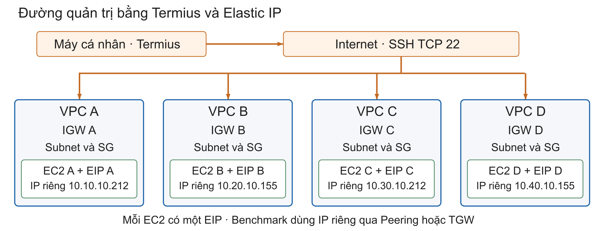

# Đồ án NT531: bốn VPC kết nối đầy đủ

## Sơ đồ kiến trúc hệ thống thử nghiệm


Các kết nối AB, AC, AD, BC, BD và CD tạo toàn lưới. Ba đường xanh là
các Peering được dùng khi A, C và D cùng gửi về B; mũi tên hai chiều
thể hiện kết nối và phản hồi, không có nghĩa benchmark chạy tải cả hai chiều.


TGW nối cùng bốn VPC bằng bốn attachment. Bảng TGW mặc định dùng
association và propagation. Mỗi VPC có ba route tới CIDR của các VPC
còn lại, tổng 12 route. Biến routing_mode chọn target của từng route
là Peering đúng cặp hoặc TGW; không tự chia lưu lượng qua cả hai mode.



Mỗi EC2 có một EIP để Termius kết nối từ máy cá nhân qua Internet và
IGW của VPC. Benchmark dùng IP riêng. Các ảnh là sơ đồ logic của cấu
hình Terraform và metadata các phiên đo; mỗi VPC có subnet, SG và
route table riêng. Bốn EC2 cùng AZ us-east-1a trong region us-east-1.

Bài một cặp dùng A→B:5201. Bài ba nguồn dùng A→B:5201, C→B:5202,
D→B:5203 cùng lúc; B chạy ba listener riêng. Mô hình và diễn giải này
đã được thêm vào [chương kết quả DOCX](13-chuong-ket-qua.docx).

## Phạm vi triển khai

| Máy | VPC | Subnet | IP riêng | Vai trò TCP |
|---|---|---|---|---|
| A | 10.10.0.0/16 | 10.10.10.0/24 | 10.10.10.212 | Client → B |
| B | 10.20.0.0/16 | 10.20.10.0/24 | 10.20.10.155 | Server 5201 |
| C | 10.30.0.0/16 | 10.30.10.0/24 | 10.30.10.212 | Client → D |
| D | 10.40.0.0/16 | 10.40.10.0/24 | 10.40.10.155 | Server 5201 |

C/D dùng AMI, loại instance và key pair của A; AZ us-east-1a, disk 8 GiB
gp3 như A/B. Mỗi máy có EIP riêng cho SSH. Các máy mới khởi chạy ngay
khi tạo, còn trạng thái running/stopped của A/B không được code này đổi.
Không dùng user data để sửa máy đã import. Script SSH
`scripts/Initialize-Experiment.ps1` cài công cụ, bật ba listener iperf3
và kiểm tra mạng. Listener tự khởi động lại theo EC2. Trạng thái thực tế
và phiên bản đã cài được ghi trong nhật ký triển khai.

Peering có đủ AB, AC, AD, BC, BD, CD (6 kết nối). TGW khi bật có
bốn attachment dùng bảng TGW mặc định với association/propagation.
Mỗi VPC có ba route liên VPC (12 route toàn hệ thống). SG cho ICMP và
TCP 5201–5203 từ các endpoint còn lại. Có thể chọn một cặp, hai cặp
đồng thời hoặc A/C/D → B. TCP là bài hiện tại; UDP cần rule và thiết kế
tải riêng. Full mesh không có nghĩa phải chạy tải trên mọi chiều cùng lúc.

## Triển khai bốn máy trước

Từ thư mục dự án, tạo plan mới, không dùng các plan cũ:

```powershell
terraform '-chdir=infra/terraform' fmt -check
terraform '-chdir=infra/terraform' validate
terraform '-chdir=infra/terraform' plan '-out=four-vpc.tfplan'
```

Default của biến `enable_transit_gateway` là false để tránh tạo TGW
ngoài ý muốn. File thật `experiment.auto.tfvars` của lần triển khai đầy đủ
đặt **true**, `routing_mode="peering"`, nên cả TGW và Peering cùng tồn tại.
Đọc plan: bổ sung C/D và EIP chưa có; không được xóa/thay thế A/B.
Sau khi đã xem thay đổi và chi phí, áp dụng plan vừa tạo:

```powershell
terraform '-chdir=infra/terraform' apply 'four-vpc.tfplan'
.\scripts\Get-ExperimentInstances.ps1 | Format-Table -AutoSize
```

Tạo hai host Termius C/D bằng EIP, ec2-user và nt531-key. Chuẩn bị công cụ
trên bốn máy. Đo A→B và C→D riêng trước rồi mới đo đồng thời; ghi thời
gian thực tế để xác nhận hai bài có khoảng chạy chồng nhau.

Để kiểm tra cả bốn máy sau khi apply hoặc đổi mode:

```powershell
.\scripts\Initialize-Experiment.ps1 -CheckOnly -Mode peering
```

Đổi `-Mode tgw` khi đã apply TGW. Script kiểm tra output mode khớp và chạy
ping, TCP handshake cả ba cổng, truyền thử iperf3 1 Mbit/s trong 2 giây
trên mỗi chiều. Đây là kiểm chứng kết nối, không phải số liệu hiệu năng.
Xem [hướng dẫn đo chính thức](04-do-va-giai-thich.md).

## Đổi đường truyền sau khi đã triển khai đầy đủ

File `infra/terraform/experiment.auto.tfvars` đã có trong máy vận hành.
Không chép đè bằng bản mẫu. Để giữ TGW nhưng đo Peering, nội dung là:

```hcl
enable_transit_gateway = true
routing_mode           = "peering"
```

Nếu TGW chưa tồn tại, cần plan/review/apply để tạo trước. Khi muốn chuyển sang TGW, đổi duy nhất
`routing_mode = "tgw"` trong file thật rồi plan/review/apply mới.
Khi muốn quay về Peering, đổi mode lại nhưng giữ enable=true để giữ
cùng TGW cho các lượt tiếp theo. Không tắt enable khi mode vẫn là tgw.

Đổi mode cập nhật 12 route liên VPC; không phải thao tác nguyên tử,
có thể gián đoạn lúc hai chiều chưa đổi xong. Đợi apply hoàn tất và
kiểm tra route hai chiều trước mỗi lượt đo thông thường. Không coi đây
là kịch bản chuyển mạng không gián đoạn đã được kiểm chứng.

## Đo công bằng và chi phí

Giữ cùng bốn máy, công cụ, MTU, số luồng, thời gian và chiều truyền khi
so Peering/TGW. Đo ở MTU 1500 trước; không dùng thẳng kết quả Peering
9001 để đối chiếu TGW như thể cùng điều kiện. TGW hỗ trợ MTU tới 8500
trên đường VPC, cần thiết kế riêng nếu nghiên cứu jumbo frame.
[AWS TGW](https://docs.aws.amazon.com/vpc/latest/tgw/what-is-transit-gateway.html).

C/D tăng chi phí EC2 và EBS. Bốn EIP có tổng giá niêm yết 0.02 USD/giờ,
tương đương 0.48 USD/ngày, kể cả khi EC2 stopped. TGW phát sinh phí theo
attachment-giờ và GB xử lý: stop EC2 không dừng phí attachment. Chỉ bật
TGW khi chuẩn bị đo. Sau đợt đo, chuyển về peering trước rồi đặt enable=false,
review plan xóa TGW/attachment; giữ EC2, EIP và kết quả theo nhu cầu.
[VPC pricing](https://aws.amazon.com/vpc/pricing/) ·
[TGW pricing](https://aws.amazon.com/transit-gateway/pricing/).

Key pair `nt531-key` vẫn là phụ thuộc có sẵn, state vẫn local. Không chạy
bản sao cấu hình với state trống lên cùng tài khoản để tránh tạo trùng.
